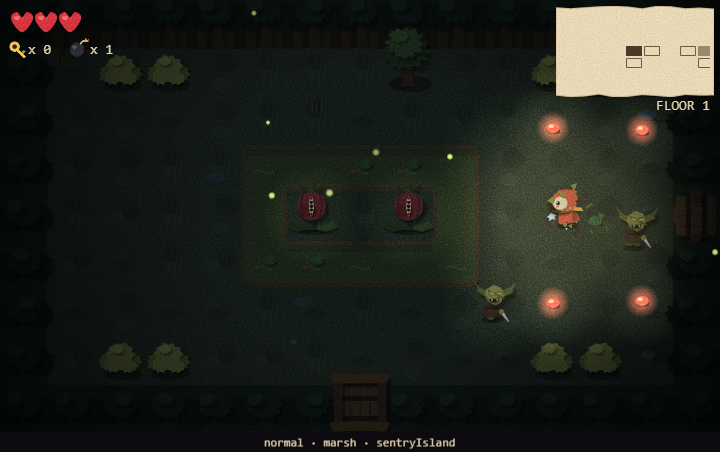
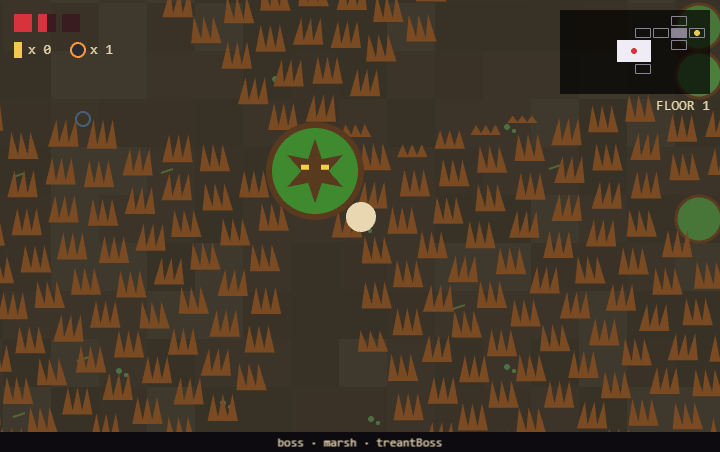

# AiGameTry2

A top-down roguelike in the style of *The Binding of Isaac*. You fight through three procedurally generated floors (forest, caves and a dungeon) and pick up passive items that change how you attack. Each floor ends with a boss. Everything is drawn with simple shapes, and it runs in the browser.



## Play it locally

You need [Node.js](https://nodejs.org/) 22.12 or newer.

```sh
npm install
npm run dev
```

Then open the address Vite prints (normally http://localhost:5173).

### Controls

| Key | Action |
|---|---|
| W A S D | Move |
| Arrow keys | Shoot (or swing, with the sword) |
| E | Drop a bomb |
| Space / Shift | Dash (once you have the Dash item) |
| Enter | Start a new run after the end screen |

You pick things up by walking into them. A chest opens when you touch it, and a locked chest needs a key.

### URL options

| Option | Effect |
|---|---|
| `?seed=123` | Plays a fixed run. The same seed always builds the same floors. |
| `?boss` | Starts at the floor-1 boss room's door, for testing. `?boss=2` and `?boss=3` go to the later floors' bosses. |

The two can be combined, e.g. `?boss&seed=42`.

## The game

**Floors.** Each floor is a set of connected rooms, about 14 on average, laid out like Isaac's. It has a start room in the middle, an item room, and a boss room at the dead end furthest from the start. Beating the boss opens the way to the next floor, and beating the third boss wins the run.

**Rooms.** Each room is built around one idea: a pillared hall, a jar-shaped trap, a puzzle chest walled in by rock. Enemies are placed to suit that idea rather than scattered at random. Some rooms span two cells or form an L. Rock breaks when you shoot it, and anything destroyed stays destroyed for the rest of the run. Each floor adds its own terrain: ponds and thorn bushes in the forest, crystals that bounce shots, chasms and glowshrooms in the caves, pits and crushers in the dungeon.

**Enemies.** Every floor has its own cast, and anything that looks different behaves differently:
- **Forest:** goblins, which fall back and heal each other when hurt; seed-spitters; charging boars; wasp swarms.
- **Caves:** lunging ghouls, ricocheting crystal turrets, erratic bats and worms.
- **Dungeon:** tough zombies, gargoyles, skeleton knights whose shields block from the front, and ghosts that drift through walls.

About one room in seven has a **champion**: a bigger, tougher enemy that drops extra loot.

**Bosses.**

| Floor | Boss |
|---|---|
| 1 (Forest) | **Treant**: walks toward you, sends up lines of roots and lobs seed pods that sprout rock and thorn. At a quarter of its health it sinks and bursts up in the middle of the room for its last stand: roots cover the room except three gaps that sweep clockwise, faster as it weakens. |
| 2 (Caves) | **Worm boss**: a long worm that rampages in bursts of straight lunges, tunnelling through the walls and out of another, lobs eggs until it splits once into two halves, and heals as its last half roars. |
| 3 (Dungeon) | **Iron Maiden** or **Candle Witch**, one picked at random each run. |



**Items.** Passive items come from item rooms and locked chests: Homing, Fire rate, Sword, Triple shot, Pierce, Ricochet, Spectral, Boomerang, Poison, Chain lightning, Freeze, Orbital and Dash. They combine, so a sword with any shot item also throws a blade wave. Each boss you beat raises one of your items to level 2.

Chests and cleared rooms also drop hearts, keys, bombs and chests. Now and then a chest holds a **Damage up** or **Fire rate up**. These stack for the whole run so your attack keeps up with tougher floors.

## Development

| Command | What it does |
|---|---|
| `npm run dev` | Dev server with hot reload |
| `npm test` | Unit tests (Vitest) |
| `npm run typecheck` | TypeScript type check |
| `npm run build` | Type check, then a production build into `dist/` |

The code is split in two:
- **`src/core/`** holds the game's rules as plain, framework-free TypeScript: floor and room generation, enemy and boss decisions, the weapon model, items and the world state. It's all deterministic for a given seed and covered by unit tests beside each module. It's grouped into `map/` (grid, tiles, floor layout, world state), `rooms/` (room generation and validation), `player/` (movement and the weapon model), `enemies/` and `bosses/`. Shared helpers such as `rng` sit at the top.
- **`src/game/`** is the [Phaser 3](https://phaser.io/) layer. It handles physics, drawing and input, and asks `core` what should happen. It's split into `scenes/`, `entities/` (with `entities/bosses/`), `ui/` and `effects/`.

`scripts/smoke.mjs` drives the running game in a headless Microsoft Edge (through Playwright) and takes screenshots. It's used to check changes in the real game:

```sh
SMOKE_URL=http://localhost:5173 node scripts/smoke.mjs treant smoke-out
```

The first argument picks a scenario, for example `walk`, `combat`, `passives`, `worm-boss` or `treant`. Each scenario is one `scenario === '...'` block in the script.

All the numbers (health, speeds, drop rates, timings) are first guesses, still being tuned by playtesting.

This project is built with the help of [Claude Code](https://claude.com/claude-code). Features are planned in GitHub issues and built test-first, one small end-to-end slice at a time.
